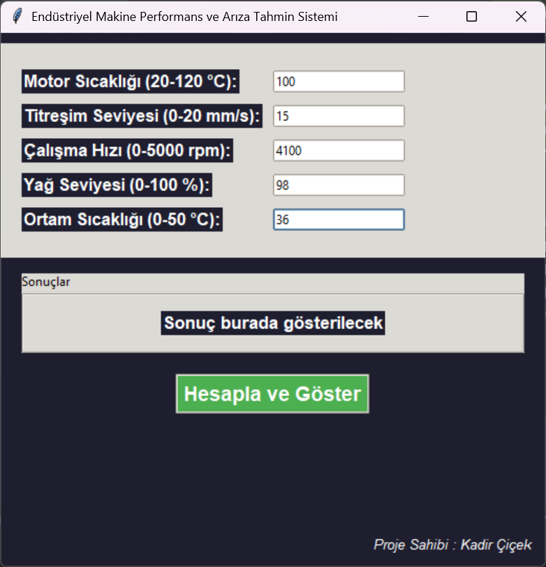
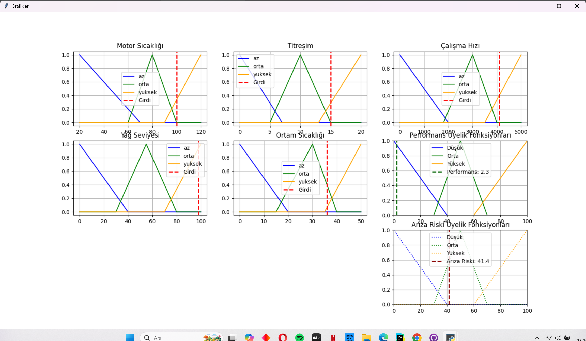
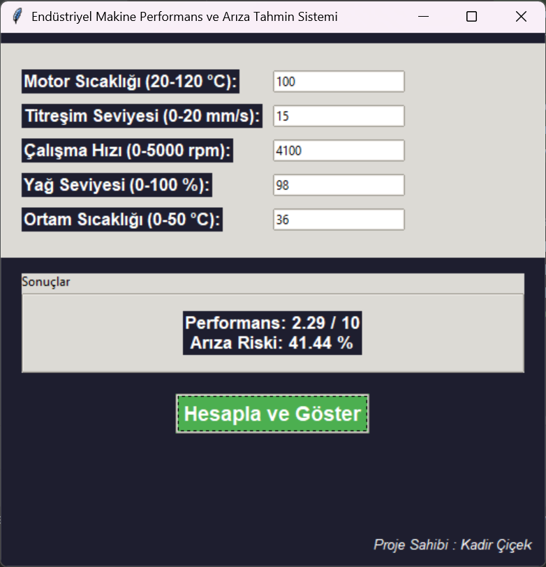

#🛠️Endüstriyel Makine Performans ve Arıza Tahmin Sistemi

  Bu proje, bulanık mantık tabanlı bir sistem kullanarak bir endüstriyel makinenin performansını ve arıza riskini tahmin etmektedir. 
 Kullanıcıdan alınan beş farklı parametreye göre (motor sıcaklığı, titreşim, çalışma hızı, yağ seviyesi ve ortam sıcaklığı), sistem makinenin genel performansını ve arıza riskini belirler.

 

  

📈 #Girdi Değişkenleri
 
   Motor Sıcaklığı (20–120 °C)

   Titreşim Seviyesi (0–20 mm/s)

   Çalışma Hızı (0–5000 rpm)

   Yağ Seviyesi (0–100%)

   Ortam Sıcaklığı (0–50 °C)

📊 #Çıktı Değişkenleri

  Performans (0–10)

  Arıza Riski (0–100%)

📌 #Üyelik Fonksiyonları ve Kurallar

 Her bir giriş ve çıkış değişkeni için [az, orta, yüksek] gibi üyelik fonksiyonları tanımlanmıştır. Sistemde bu üyeliklere dayalı olarak 16 adet bulanık kural tanımlanmıştır.

 ▶️ #Nasıl Çalıştırılır?

  pip install numpy scikit-fuzzy matplotlib

  python machine_performance.py

  

  

